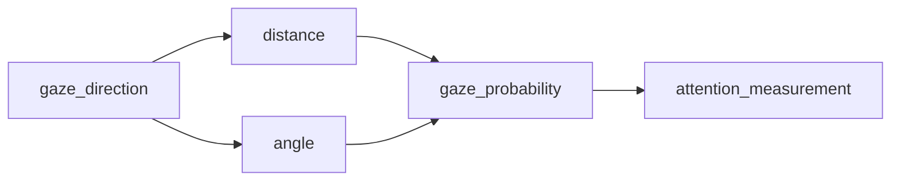

# Attention and Anxiety Analysis based on Neural Network

The purpose of this project is to quantitatively analyze the relationship between children's anxiety degree and their attention in blood collection scenario. Children's attention level is evaluated by their gaze direction, which is estimated through convolutional neural network.  Similarly, their anxiety degree is evaluated by standard measurement valence and arousal, which is calculated by neural network. Using the measurements above, we can detect whether children would be attracted by cartoon sticker. Additionally, we want to know how much the cartoon sticker could help to ease their anxiety.

In this experiment, children were divided into experimental and control groups. In the former group, the cartoon stickers are placed to attract children. In contrast, in the control group white paper is placed instead of sticker.  Also, the whole blood collection process is divided by three phrase involving early, middle and late stages to precisely compare the measures between two groups.

- ## Method

### Module 1  Attention Measurement

People's gaze direction can be captured and estimated by well-tuned neural network architecture "MPIIGaze" (https://github.com/hysts/pytorch_mpiigaze). After determining the sticker position, the predicted gaze direction can be used to calculate the distance between eyes and sticker (white paper in control group) as well as the angle between between gaze direction and sticker (white paper) direction. The angle and distance are used to generate children's probability to gaze stickers (white paper). In this way, their attention on stickers can be evaluated quantitatively. We use common metrics such as percentage of fixation duration and time point of first fixation to quantitatively measure attention level. 

### Module 2 Anxiety Measurement

People's facial emotion can be quantitatively measured by continuous values valence and arousal. In this project, the well-tuned neural network structure based on Aff-Wild Database (https://github.com/dkollias/Aff-Wild-models) is used to estimate valence and arousal given facial emotion images. Valence represents the pleasure level of the emotion. From negative to positive value, it means that the emotion changes from negative to positive. Arousal represents the active degree of emotion.  From negative to positive value, it means that the emotion changes from inactive to active.

### Module 3 Correlation Analysis

Given the prediction of attention level (probability to gaze targets including stickers in experiment group and white paper in control group) and emotion level (valence and arousal) in each image frame, we can get a series of measurements in a recorded video to evaluate the change of children's attention and anxiety. In this way, correlation analysis can be used to determine how the stickers are involved to help children ease their emotion anxiety.

## Result

The comparison on  attention measurement and emotion measurement between experiment and control groups can be briefly viewed through the box plots below. 

